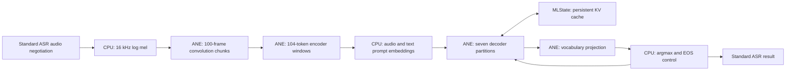

# Runtime and validation architecture

The public package exposes a batch Standard ASR engine. Its metadata, configuration, artifact inspection, and discovery stay independent of model loading. Core ML and the weights are loaded only by `prepare()` or the first transcription. Inference is serialized per engine instance.

`CPU_AND_NE` excludes GPU. This is a permitted-device policy, not a guarantee that Core ML selects ANE. The compute-plan reports record anticipated placement, while Instruments traces record actual ANE hardware events. Together they cover every major neural stage in the tested bundle; they do not measure a fraction of total FLOPs or prove lower energy.

## Numerical representation

All expensive linear projections use channel-first 1×1 convolutions. Attention is split by head to keep the graph four-dimensional and avoid materializing repeated GQA caches. Host-computed rotary factors, attention masks, and cache-update matrices have fixed shapes.

The decoder residual can reach roughly 10,880 on the initial real-weight probes. Squaring it directly in FP16 overflows. `StableRMSNorm` first divides by a per-token maximum, computes the mean square in that bounded range, and adjusts epsilon for the same scale. Epsilon is expressed through its square root before squaring, so its initial constant remains in the normal FP16 range. This changes the numerical representation rather than clipping the model.

The first experiment scaled the residual, value weights, and up-projection weights by 64. It was algebraically correct in FP32 but produced about 20% relative error on ANE. The tested bundle therefore uses scale 1. Lower precision remains a measured approximation: parity tests, real-token replay, and end-to-end scoring all have distinct jobs.

## Prefill and generation

The first working graph processed one token per call. It spent most of its time in prompt prefill. The T16 candidate processes up to 16 valid tokens in one call. A causal mask prevents looking forward, and an update matrix writes only valid positions to the fixed cache. A tail chunk or generation step pads unused rows, whose update entries are all zero. The vocabulary projection sees only the last valid hidden vector.

Both phases use the same loaded model and MLState. No correctness assumption is made about sharing state between independently loaded Core ML functions or models. A new utterance allocates fresh states for every partition.

The initial cache length is 1024 and audio limit is 30 seconds. The runtime checks that prompt plus requested generation budget fits before model execution. Exceeding the token budget before EOS raises an error. Silence is evaluated explicitly rather than hidden with an unvalidated VAD threshold.

## Reproducible feedback

The workflow is download → conversion → unit parity → protocol checks → real transcription → corpus comparison → placement inspection → hardware trace → efficiency comparison. Each stage owns its evidence. A timeout kills the entire subprocess group, each attempt keeps separate logs, and resume requires matching source, model, input, code, dependency, and evidence fingerprints.

Quality uses the same normalization for both systems and separates English WER from Chinese CER. Public corpus selection is deterministic and fixed before looking at model results. The release gate remains stricter than an experimental corpus result. Energy is unavailable unless real samples exist; power permissions are never replaced with guessed joules or inferred savings.
